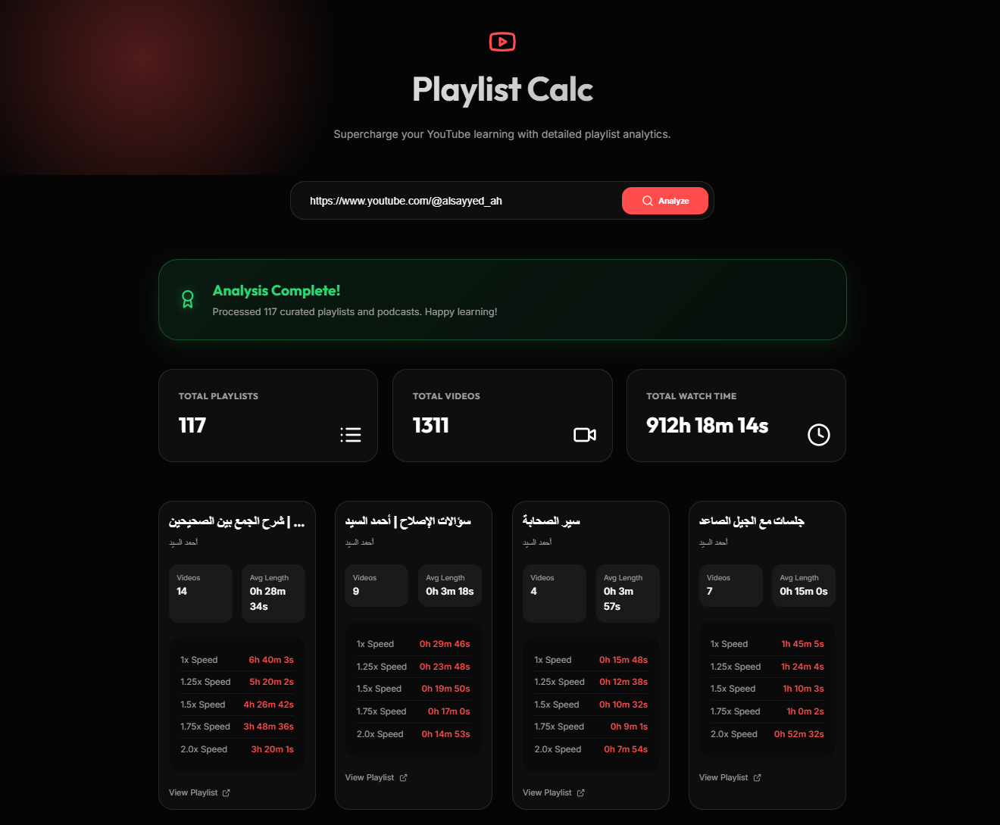

# 📺 YouTube Playlist Dashboard

[](https://reactjs.org/)
[](https://flask.palletsprojects.com/)
[](https://vitejs.dev/)
[](https://www.python.org/)

A premium, modern web dashboard for analyzing YouTube channel content. It provides deep insights into curated playlists and podcasts, featuring real-time streaming calculations and a stunning glassmorphism interface.



## ✨ Key Features

- **🚀 Real-Time Streaming**: Watch results "pop in" live as the backend processes each playlist.
- **🔍 Deep Content Discovery**: Automatically scans and uncovers curated playlists, "Created Playlists" sections, and Podcasts.
- **⚡ Speed Analysis**: Instant watch-time calculations for multiple playback speeds (1.25x, 1.5x, 1.75x, 2.0x).
- **💎 Premium Aesthetics**: Modern dark-mode UI with glassmorphism, accent glows, and smooth micro-animations.
- **📊 Channel Summary**: Comprehensive overview of total watch time and video counts across all discovered content.

## 🛠️ Tech Stack

- **Frontend**: React 19, Vite, Framer Motion (animations), Lucide React (icons).
- **Backend**: Flask, Flask-CORS, `yt-dlp` (YouTube data extraction).
- **Styling**: Vanilla CSS with a custom design system and modern typography (Inter, Outfit).

## 🚀 Getting Started

### Prerequisites
- Python 3.7+
- Node.js (v18+)

### Installation

1. **Clone the repository**:
   ```bash
   git clone <your-repo-url>
   ```

2. **Run the Automated Startup Script**:
   On Windows, simply run the included batch file to start both the backend and frontend simultaneously:
   ```bash
   .\run_app.bat
   ```

### Manual Setup (Optional)

**Backend**:
```bash
python -m venv venv
.\venv\Scripts\activate
pip install -r requirements.txt
python server.py
```

**Frontend**:
```bash
cd frontend
npm install
npm run dev
```

## 📝 License

This project is licensed under the MIT License. Built with ❤️ for the YouTube learning community.
